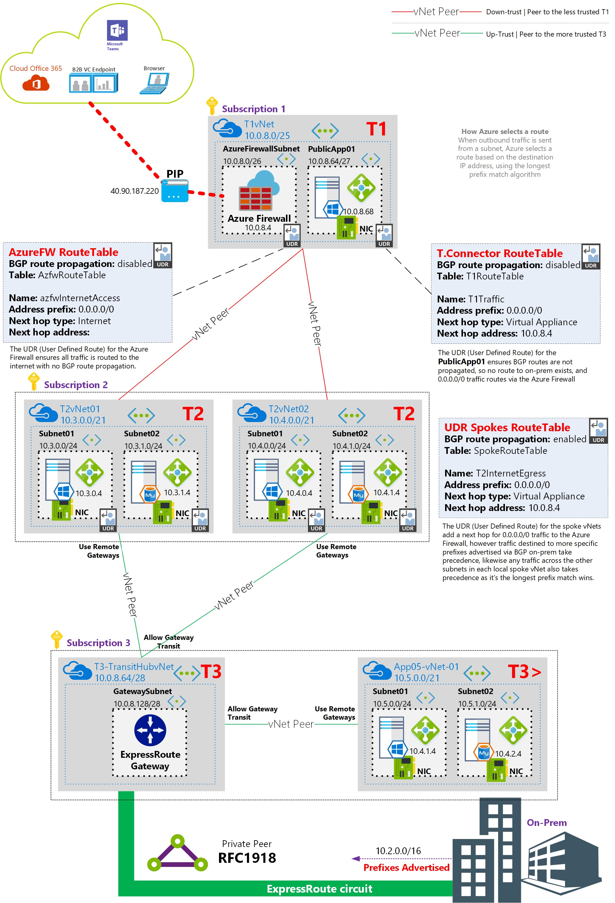
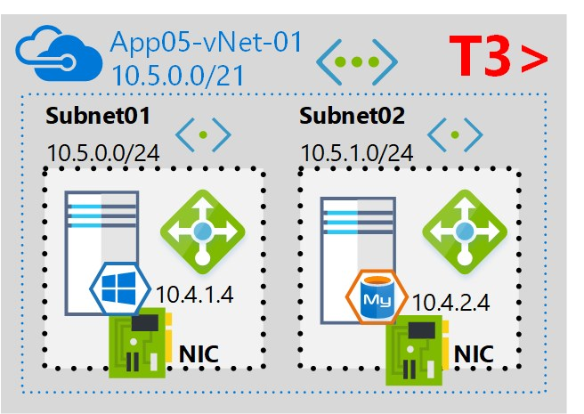

# The Azure 3 Tier Network
For the serious security concious, this is one way to do networks from within Azure. In brief, the T1 vNet can't talk directly with the T3 vNet and vice versa. 

## Azure-T3 plus Network
This repo is for beyond the Tier 3 part of the 3 tier network - it's the most isolated & trusted network in Azure.

To deploy the middle T2 layer of this Azure network:

